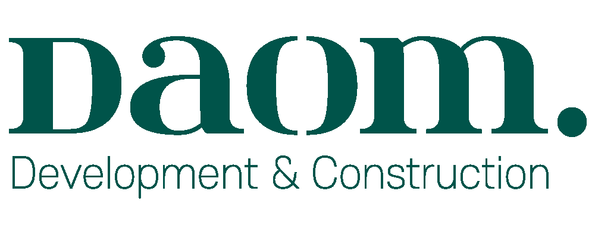

# 다옴디앤씨 회사 소개 웹페이지



㈜다옴디앤씨 (DAOM D&C Co., Ltd.) 회사 소개 단일 페이지 웹사이트입니다.

## 파일 구조

```
daom/
├── assets/
│   ├── logo-horizontal.png   # 가로형 로고
│   └── logo-stacked.png      # 세로형 로고
├── index.html                # 메인 웹페이지 (HTML/CSS/JS 단일 파일)
├── references/               # 참고 자료 (git 추적 제외)
└── README.md
```

## 주요 섹션

- 인사말 (CEO Message)
- 회사 개요
- 사업 분야 — 수주컨설팅 / 총회대행 / 이주관리 및 촉진 / 세입자조사
- 조직도
- 파트너십
- 주요 실적
- 연락처

## 미리보기

[웹사이트 미리보기](https://raw.githack.com/hebinalee/daomdnc/master/index.html)

## 실행 방법

`index.html`을 브라우저에서 직접 열면 됩니다. 별도 빌드 과정 없음.
